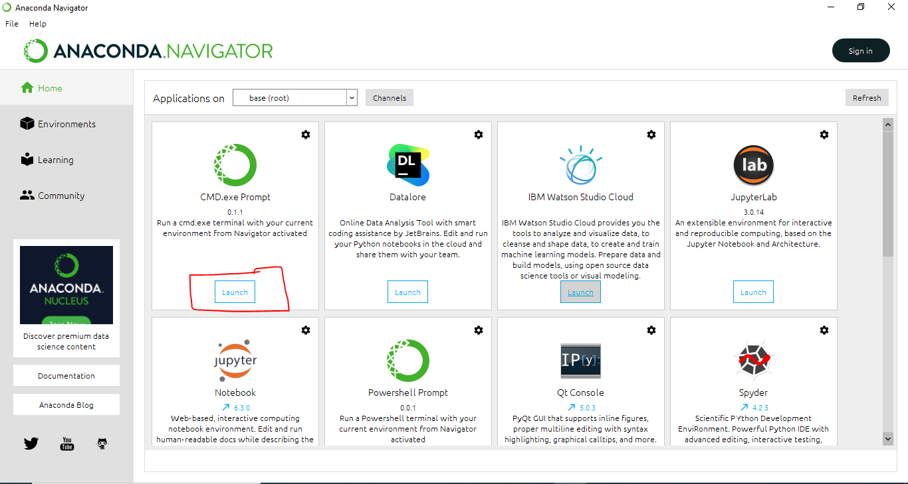
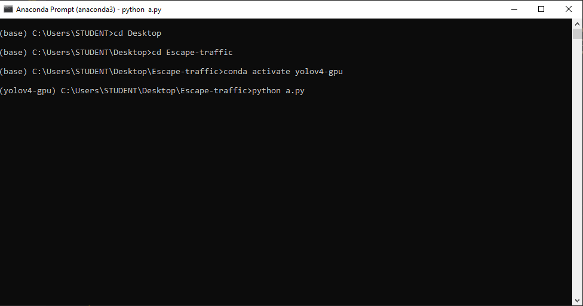
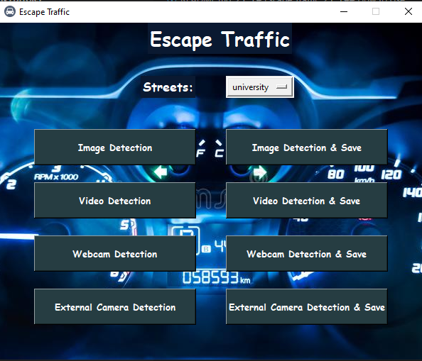
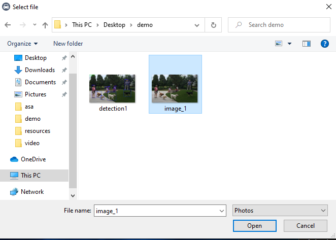
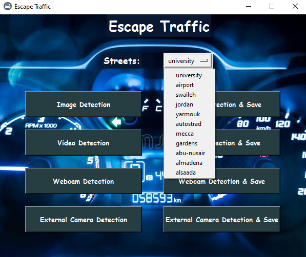
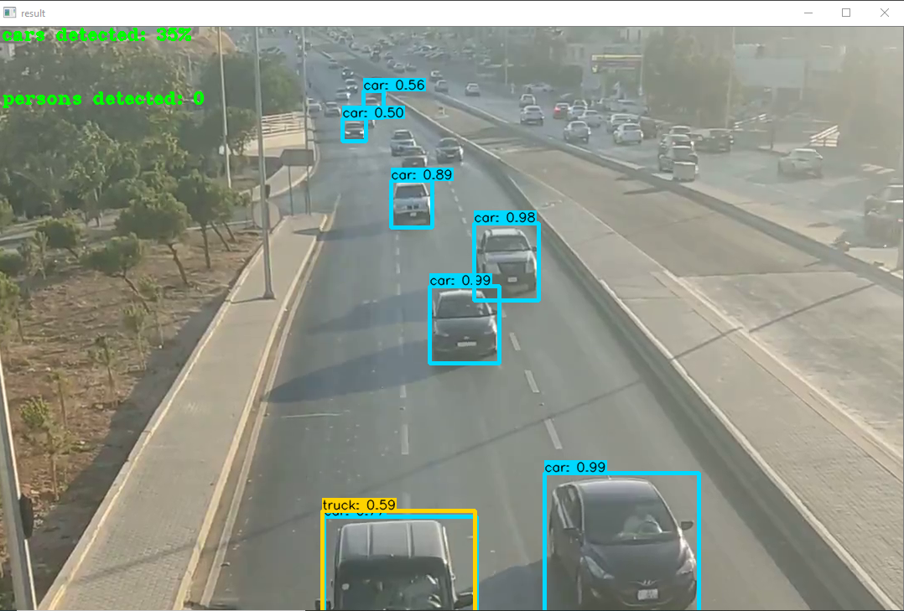

# Escape-traffic

**Team members**

* Mohammad Nada

* Abdel Hadi Nofal

* Qusai Qishta

* Abdalrahman Samara

### **Traffic Percentage**

Our idea is to count the cars going on a certain street, and return a live percentage of the traffic jam. If the percentage reaches a certain point, it will send an alarm. also, if there is a human life in danger on highways, we will contact the authorities directly to tell them that there is a possibility of an accident on that road, and they need to check the cameras.

This project would save people from getting stuck in a traffic jam, and it would save lives

### **PM**

for the project management, we are going to use Trello, to divide all the tasks and focus on the workflow of the project

[Our Project Management Tool](https://trello.com/b/Cdz722Xv/team-project)

### User Stories: 
 

1. Webcam or video ; As a user I want my application to open my cam.
    a.Feature Task:
         I can Choice my cam, or upload the video from my side
    b. Acceptance Test :
            insure can I add the video to test.
2. Count; As a user I want to count the cars in the street .
    a. Feature Tasks:
        the app count all cars in the screen and give the result
    b. Acceptance Test :
	    return the all counted cars , as number 
3. HighAccuracy; As a user I want high accuracy to count cars.
    a. Feature Tasks:
        most the accuracy more than 90% 
    b. Acceptance Test 
        test by image , already known the counts number , 
        test the video that have result a;ready
4. Get percentage; As A user I want to get the percentage of cars in
   a. Feature Tasks: 
        a. depends on the street, I want to know how much traffic is ?as result  
    b. Acceptance Test 
        test the known street capacity and 
5. Text Alarm; As a User I want to send me A text that tell me there A high traffic in
   a. Feature Tasks: 
        in case the street have 90% or more then The app will send a text to relative department to inform 
    b. Acceptance Test 
        add number text it manually 

## Installation

there are two installations, for people who have Nvidia External graphics cards and for the ones who don't, the first one is for the one's who don't have the card, they must use it, and it's optional for people who have the card to choose between the first and the second one:

> first way for installation (Recommended)

you **must** use this installation if you **don't have Nvidia External graphics card**, i will walk you through each step:

1. clone this repository on your local machine.

2. install Anaconda : press on this link [here](https://www.anaconda.com/products/individual) to install anaconda

3. after finishing installing Anaconda, Enter the Application, the interface below is what are you going to see, select CMD.exe Prompt Launcher as in the image:



4. now, we need to create the Environment to hold all the libraries, most of the libraries will be installed automatically, but you need to add some of them by yourself. to create an environment and download dependencies, you need to Enter this command inside the CMD:

this command is for Tensorflow GPU, if you want to run the code on your GPU, which is way faster than the CPU:

``` conda env create -f project.yml ```

and this code is for Tensorflow CPU:

``` conda env create -f project1.yml ```

this command will create the environment for you, this will take some time

5. every time you need to work on the repository, you need to activate the environment. to activate the Environment, Enter this command:

``` conda activate project ```

currently, you are inside the environment.

6. there is one folder (the weights folder), that you need to install from google drive, this folder could not be pushed to gitHub because it's extremely large, click on this [Link](https://drive.google.com/drive/folders/14NaJincTk836Buun76YlgmAIGFV69Ubx?usp=sharing) to download the checkpoints folder, after you download it, you need put directly inside the repository's folder.

7. type ``` python a.py ``` to run the GUI for this project

> second way for installation

if you have Nvidia External graphics card, there is no need to do the first installation. instead, you can follow these steps:

1. clone this repository on your local machine.

2. now, we need to install all the libraries, most of the libraries will be installed automatically, but you need to add some of them by yourself. to create an environment and download dependencies, you need to Enter this command inside the CMD:

for Tensorflow on CPU:

``` pip install -r requirements.txt ```

for Tensorflow on GPU:

``` pip install -r requirements-gpu.txt ```

## Nvidia Driver (For GPU, if you are not using Conda Environment and haven't set up CUDA yet)

Make sure to use CUDA Toolkit version 10.1 as it is the proper version for the TensorFlow version used in this repository.

you can install it directly from [here](https://developer.nvidia.com/cuda-10.1-download-archive-update2)

3. there is one folder (the weights folder), that you need to install from google drive, this folder could not be pushed to gitHub because it's extremely large, click on this [Link](https://drive.google.com/drive/folders/14NaJincTk836Buun76YlgmAIGFV69Ubx?usp=sharing) to download the checkpoints folder, after you download it, you need put directly inside the repository's folder.

4. type ``` python a.py ``` to run the GUI for this project

## How to Use

After discussing the installation part, we need to discuss how to use this application. if the installation went successfully, this should work fine on your local device.

1. in Anaconda's CMD.exe Prompt, go to the repository directory

2. activate the environment by typing ``` conda activate project ```

3. open the GUI by typing ``` python a.py ``` as in the image below



4. if the CMD gave you an error ``` ModuleNotFoundError: No module named 'xxxxx' ```, you just install it by using ``` pip install xxxxx ```

5. Now, you can see the interface in the image below, this interface has 8 functionalities.



a. Image detection: this feature is going to detect multiple objects inside images, and give you the count for each object that detected, this model can detect 80 objects, you just select the image from your laptop, and it will start detecting and give you the result.




b. Image detection & save: it's the same as Image detection, but it will ask you where to save the image after it finish detecting.

c. Video detection: this feature is going to detect multiple objects inside videos frame by frame, and give you the count for people and a ratio for cars, this ratio represents the traffic jam percentage at this street, which is dividing the current count of cars to the maximum number of cars for the street, if this ratio reaches 100%, this means that this street currently has a traffic jam. in the case of video detection, it's not going to do anything because this is an already recorder video. for this feature, you need to specify the street name, this will affect the maximum capacity, and if the street is considered as a city street or a highway. the streets covered in this project are specified in the image below:



after you select the proper street, you need to select the video, after you select it, it will start detecting objects in the video frame by frame, your experience will directly be affected by your device's performance, the image below is just one frame of a video detection



d. Video detection and save: it's the same as video detection, but it's going to ask you were do you want to save the detected video, you just select where to save it

**Note**

if you want to stop the video detection anytime you want, just press the "q" button

e. Webcam detection: this is a really interesting feature in this project, where you can have live detections for objects, and it has two extra features for traffic jam action and human safety

**Note**

don't forget to specify the street Name.

**Features**

1. in case of a traffic jam, it will call the authorities telling them that there is a traffic jam on "xxxx" street.

2. in the highways street, if this model detected that there is a human in danger, it's going to make an emergency call, telling them to check the camera at "xxxx" street for a possibility of a human life in danger, this feature can save lives. the image below is for the phone call currently made in the case of human danger.


f. Webcam detection and save: it's the same as webcam detection, with an extra feature of saving the detections.

g. External Camera Detection: if you want to use external cameras instead of the webcam, just connect it to your laptop, and select the External Camera Detection option. this option has the same functionalities as the webcam.

**Note**

don't forget to specify the street Name.

h. External Camera Detection & Save: it does the same thing as the External Camera Detection, with an extra feature of saving the detections on your local device.

## IMPORTANT NOTES:

* some of the dependencies might not be installed, you just need to install them using:

``` pip install (name of the library) ```

* if you forgot to select a street, the default street will be selected

* if you want to have the same experience with the phone calls, you need to register on [this](https://twilio.com/) website, get the account sid, auth token and the phone number, then replace them inside detect_video.py with your own, don't forget to validate you phone number and replace the one that is there right now.

* if you connected a camera to your laptop, and the external cameras detection didn't work, change the default webcam in your laptop to the connected one, and press on the webcam detection. this model doesn't support all types of cameras.

* this project is only available for windows devices only.